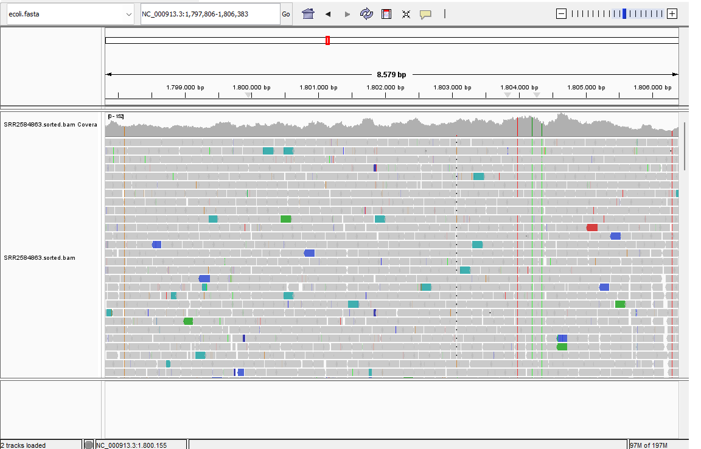

# NGS QC & Alignment Pipeline

A reproducible pipeline for quality control, trimming, and alignment of paired-end Illumina sequencing data, using *E. coli* K-12 as a test dataset.

## Context

This project implements a standard QC → trim → align workflow for paired-end Illumina data (SRA accession `SRR2584863`, *E. coli* K-12), reproducing the core steps used in production genomic surveillance and translational research pipelines. The workflow mirrors the process applied in real-world NGS surveillance work — including SARS-CoV-2 genomic monitoring (Parque Tecnológico Itaipu) — restructured here as a reproducible, version-controlled pipeline with documented QC criteria at each step.

## Pipeline

```
FASTQ (raw) → FastQC → fastp (trimming) → BWA-MEM (alignment)
→ samtools (sort/index) → MultiQC (consolidated report)
```

## How to run

1. Clone this repository
2. Create the environment:
   ```bash
   mamba env create -f environment.yml
   conda activate ngs-qc
   ```
3. Run the pipeline scripts in order:
   ```bash
   bash scripts/01_download.sh
   bash scripts/02_qc_raw.sh
   bash scripts/03_trim.sh
   bash scripts/04_align.sh
   bash scripts/05_multiqc.sh
   ```

## Results

- **83.8%** of reads passed quality filtering (fastp)
- **94.37%** of reads mapped to the reference genome
- **91.28%** properly paired
- **0.67%** singletons

### QC observations
Read 2 showed lower quality than Read 1 (Q30: 84.7% vs 93.6%), consistent with per-tile and per-base quality issues flagged by FastQC — a known pattern in Illumina paired-end sequencing, where R2 quality tends to degrade due to longer exposure during the sequencing run. This is reflected in the slightly lower mapping rate (94.37% vs the >95% typically expected for a well-sequenced bacterial genome) and confirms consistency across the FastQC, fastp, and samtools reports.

Adapter content flagged in raw FastQC reports was resolved after trimming with fastp (329,179 reads had adapters trimmed).

### MultiQC report
See `results/multiqc/multiqc_report.html` for the consolidated QC, trimming, and alignment report.

### IGV visualization


## Technologies

fastp, FastQC, BWA-MEM, samtools, MultiQC, IGV, conda/mamba, SRA Toolkit

## Notes

Intermediate files (raw FASTQ, trimmed FASTQ, SAM/unsorted BAM) are excluded from version control via `.gitignore`, following standard practice for reproducible pipelines — see `scripts/01_download.sh` to regenerate raw data, and `scripts/03_trim.sh`/`scripts/04_align.sh` for intermediate outputs.
